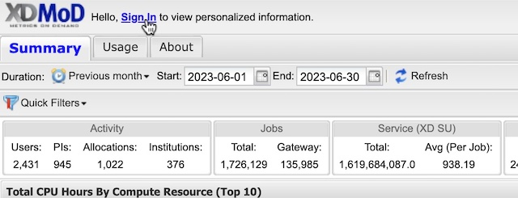
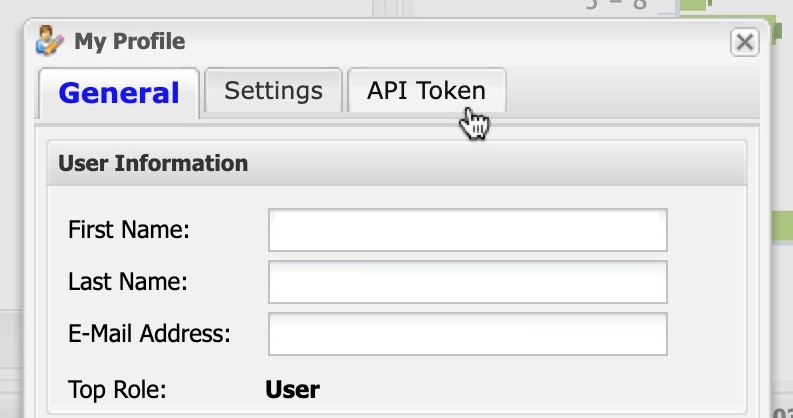
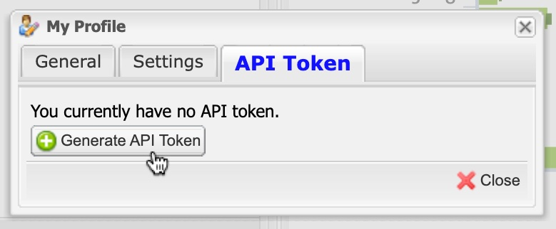
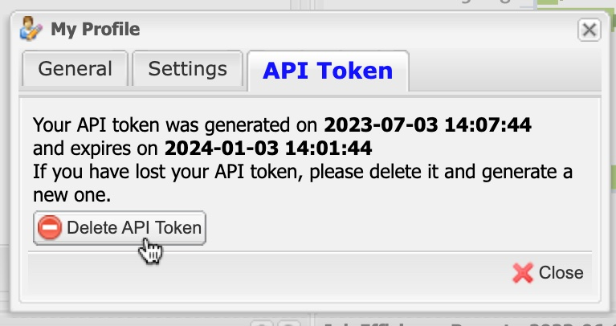
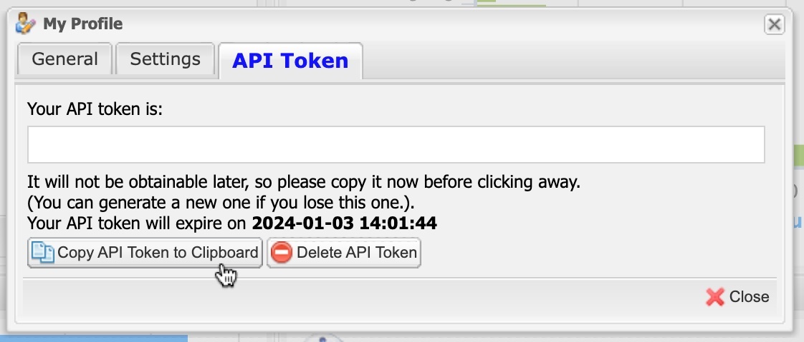

# xdmod-data
This Python package provides API access to the data warehouse of a running instance of [XDMoD](https://open.xdmod.org/).

Example usage is documented through Jupyter notebooks in the [xdmod-notebooks](https://github.com/ubccr/xdmod-notebooks) repository.

The details of the API are documented through [Read the Docs]().

## Generating an API token
In order to use the API, you will need to generate an API token through the portal of the XDMoD instance whose data you want to access.
1. First, if you are not already signed in to the portal, sign in in the top-left corner:
    
1. Next, click the "My Profile" button in the top-right corner of the window:
    
1. The "My Profile" window will appear. Click the "API Token" tab:
    
    **Note:** If the "API Token" tab does not appear, it means that instance of XDMoD is not configured for API access through `xdmod-data`.
1. Click the "Generate API Token" button:
    
    **Note:** If you already have a token and want to generate a new one, first delete the existing one:
    
1. Copy the token to your clipboard. Make sure to paste it somewhere for saving, as you will not be able to see the token again once you close the window (if you lose your token, simply delete it and generate a new one):
    

## Support
For support, please see [this page](https://open.xdmod.org/support.html). If you email for support, please include the following:
* `xdmod-data` version number (obtained from the file `xdmod_data/__version__.py`).
* Operating system version.
* A description of the problem you are experiencing.
* Detailed steps to reproduce the problem.

## Reference
When referencing XDMoD, please cite the following publication:

> Jeffrey T. Palmer, Steven M. Gallo, Thomas R. Furlani, Matthew D. Jones, Robert L. DeLeon, Joseph P. White, Nikolay Simakov, Abani K. Patra, Jeanette Sperhac, Thomas Yearke, Ryan Rathsam, Martins Innus, Cynthia D. Cornelius, James C. Browne, William L. Barth, Richard T. Evans, "Open XDMoD: A Tool for the Comprehensive Management of High-Performance Computing Resources", *Computing in Science & Engineering*, Vol 17, Issue 4, 2015, pp. 52-62. DOI:10.1109/MCSE.2015.68
